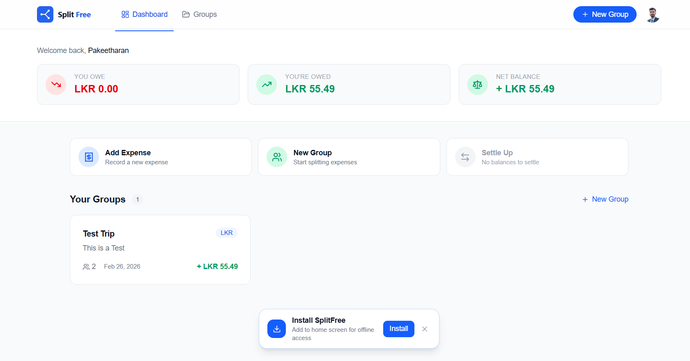

# SplitFree

> Open-source, offline-first expense splitting — no subscriptions, no paywalls.

[](LICENSE)
[](https://nextjs.org)
[](https://www.typescriptlang.org)
[](https://tailwindcss.com)



---

## Live Demo

> **[splitfree.vercel.app](https://splitfree.vercel.app)**

---

## Features

| Feature | Description |
|---|---|
| **Google Sign-In** | One-tap OAuth via Supabase — no passwords |
| **Group Management** | Create groups, set a default currency, soft-delete safely |
| **Virtual Members** | Add friends who don't have an account; auto-link when they join |
| **Smart Settlements** | Greedy-netting algorithm minimises the number of transfers |
| **Offline-First** | Full read/write while offline; syncs automatically on reconnect |
| **Conflict Resolution** | Last-Write-Wins with `updatedAt` versioning |
| **Excel Export** | Download expenses + settlements as a formatted `.xlsx` |
| **Public Share Links** | Time-limited, revocable read-only dashboards |
| **PWA** | Installable on any device, works like a native app |

---

## Tech Stack

| Layer | Technology |
|---|---|
| Framework | [Next.js 16](https://nextjs.org) (App Router) |
| Auth | [Supabase Auth](https://supabase.com) — Google OAuth |
| Database | [MongoDB Atlas](https://www.mongodb.com/atlas) |
| Offline Storage | [Dexie (IndexedDB)](https://dexie.org) |
| Styling | [Tailwind CSS v4](https://tailwindcss.com) |
| Language | TypeScript 5 |
| Validation | [Zod](https://zod.dev) |
| Export | [ExcelJS](https://github.com/exceljs/exceljs) |
| PWA | [@serwist/next](https://serwist.pages.dev) |
| Icons | [Lucide React](https://lucide.dev) |

---

## Getting Started

### Prerequisites

- **Node.js** ≥ 20
- A free [Supabase](https://supabase.com) project
- A free [MongoDB Atlas](https://www.mongodb.com/atlas) cluster (M0)
- A [Google Cloud](https://console.cloud.google.com) project with OAuth 2.0 credentials

### 1 — Clone & install

```bash
git clone https://github.com/Pakeetharan/splitfree.git
cd splitfree
npm install
```

### 2 — Configure environment

```bash
cp .env.example .env.local
```

Open `.env.local` and fill in every value (see [Environment Variables](#environment-variables) below).

### 3 — Run locally

```bash
npm run dev
```

Open [http://localhost:3000](http://localhost:3000).

### 4 — Build for production

```bash
npm run build
npm start
```

---

## Environment Variables

Copy `.env.example` to `.env.local` and provide the following:

| Variable | Where to find it |
|---|---|
| `NEXT_PUBLIC_SUPABASE_URL` | Supabase → Settings → API |
| `NEXT_PUBLIC_SUPABASE_ANON_KEY` | Supabase → Settings → API |
| `SUPABASE_SERVICE_ROLE_KEY` | Supabase → Settings → API (keep secret — server-side only) |
| `MONGODB_URI` | Atlas → Connect → Drivers |
| `MONGODB_DB_NAME` | Your chosen database name (e.g. `splitfree`) |
| `NEXT_PUBLIC_APP_URL` | `http://localhost:3000` locally, your domain in production |

---

## Project Structure

```
src/
├── app/                    # Next.js App Router — pages & API routes
│   ├── api/                # REST endpoints (groups, expenses, members, settlements, share, sync)
│   ├── dashboard/          # Authenticated dashboard
│   ├── login/              # Login page
│   ├── offline/            # Offline fallback
│   └── share/[token]/      # Public share dashboards
├── components/
│   ├── auth/               # Auth components
│   ├── expenses/           # Expense card, form, list
│   ├── groups/             # Group card, form, tabs
│   ├── members/            # Member card, add-member form
│   ├── settlements/        # Balance chart, settle form, settlement card
│   ├── share/              # Public dashboard, share dialog
│   ├── layout/             # Header, user menu
│   └── ui/                 # Base components (button, input, card, dialog…)
├── lib/
│   ├── engine/             # Balance calculator, settlement optimizer, split calculator
│   ├── export/             # XLSX generator
│   ├── hooks/              # Custom React hooks
│   ├── mongodb/            # DB client & typed collections
│   ├── offline/            # Dexie DB, sync engine, sync queue
│   ├── services/           # Server-side service layer
│   ├── supabase/           # Auth client (browser, server, middleware)
│   ├── validators/         # Zod schemas
│   └── utils.ts            # Shared helpers
├── types/                  # TypeScript interfaces & API types
└── proxy.ts                # Next.js 16 auth middleware
```

---

## Deployment

The recommended deployment platform is [Vercel](https://vercel.com):

1. Push this repo to GitHub.
2. Import the repo in Vercel.
3. Add every variable from `.env.example` in the Vercel project settings.
4. Deploy.

> **MongoDB Atlas**: whitelist `0.0.0.0/0` (or Vercel's egress IPs) under Atlas → Network Access.
> **Supabase**: add `https://yourdomain.com/api/auth/callback` under Authentication → URL Configuration → Redirect URLs.

---

## Contributing

Contributions are welcome! Please read [CONTRIBUTING.md](CONTRIBUTING.md) before opening a pull request.

---

## Code of Conduct

This project follows the [Contributor Covenant Code of Conduct](CODE_OF_CONDUCT.md). By participating, you agree to uphold it.

---

## License

Distributed under the [MIT License](LICENSE).
